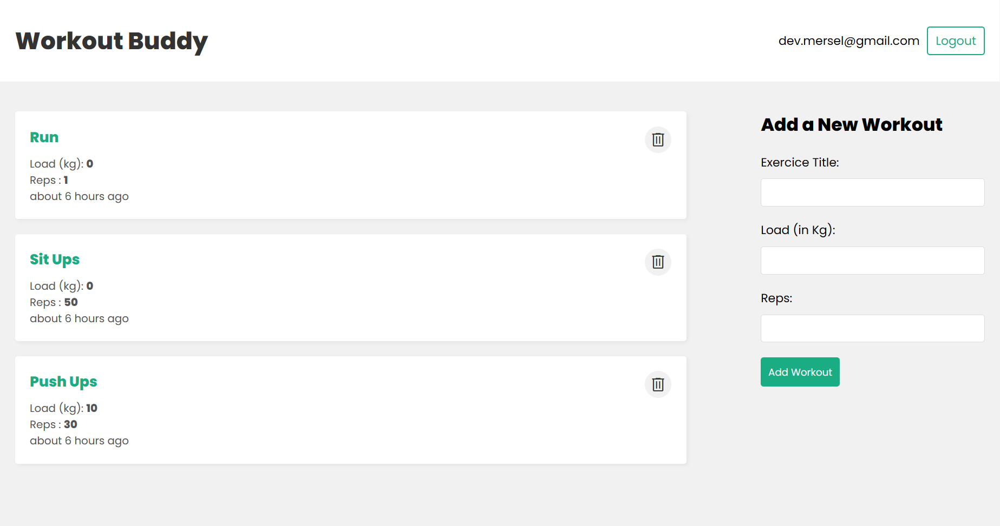

<br />
<div align="center">
  <a href="https://github.com/lyes-mersel/tuto-workout">
    
  </a>

  <h3 align="center">WORKOUT APP</h3>
    <p align="center">
      <a href="https://tuto-workout.onrender.com">View Demo</a>
    </p>
  <br />
</div>


## About The Project
Free hosting methods often have high latency, so I decided to serve static files from the server itself. This way, I don’t need a web server for the frontend code. This architecture can boost my web app’s performance by lowering the latency. However, separating the front-end and back-end can also have benefits, such as easier scalability and better handling of high traffic. Since I don’t expect much traffic to my app, I used the react app build folder as a public folder.
To see the version with the frontend and backend separated, please visit these links:
[FRONT](https://github.com/lyes-mersel/tuto-workouts-frontend) . [BACK](https://github.com/lyes-mersel/tuto-workouts-backend)




## Built With

-  HTML/CSS
-  JavaScript
-  React js
-  Node js
-  Express
-  Mongo DB


## Installation

1. Clone the repo
   ```sh
   git clone https://github.com/lyes-mersel/tuto-workout.git
   ```
2. Install NPM packages
   ```sh
   npm install
   ```
3. Launch the server
    ```sh
    npm run dev
    ```


## Environment Variables

To run this project, you will need to add the following environment variables to your .env file

`PORT` => Port to use for the application

`MONGO_URI` => MongoDB Database URI

`SECRET` => The JWT signing secret


## Author
- Website - [Portfolio](https://lyes-mersel.netlify.app)
- Github - [@lyes-mersel](https://github.com/lyes-mersel)
- LinkedIn - [@lyes-mersel](https://www.linkedin.com/in/lyes-mersel/)
